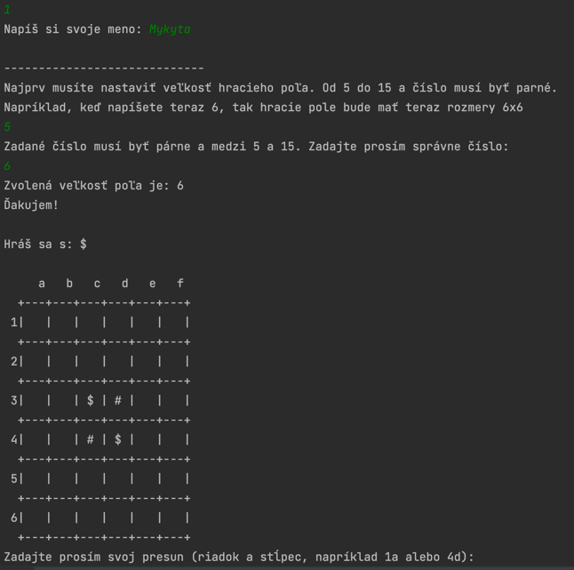
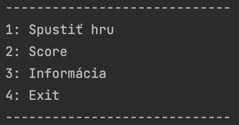
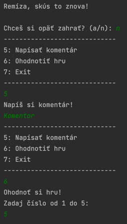

# *`Reversi`*

#### Mykyta Kolmohorov

---

Hra Reversi predstavuje hraciu plochu, na ktorej sú umiestnené hráčove žetóny a žetóny protivníka. \
Cieľom je zaplniť pole čo najväčším počtom svojich žetónov.

#### *Field*

Trieda Field vytvorí hracie pole na základe čísla zadaného hráčom, číslo musí byť dvojica od 5 do 16.

#### *FieldPlayers*

Keď je hracie pole nakreslené, trieda FieldPlayers umiestni hráčov do stredu hracieho poľa.

#### *Menu*

Trieda Menu je zodpovedná za zobrazenie menu pre hráča, v ktorom má na výber, môže začať novú hru, zobraziť informácie
alebo ukončiť hru. \
Po skončení hry bude požiadaný o opätovné hranie, ak odmietne, zobrazí sa ďalšie menu, kde môže napísať komentár alebo
ohodnotiť hru.

#### *ComputerMoving*

Trieda ComputerMoving je zodpovedná za logiku hry bota. \
Kód vypočíta najvhodnejší pohyb pre bota a vykoná ho prostredníctvom funkcie *`PlayerMoving.doMoving()`*

#### *PlayerMoving*

Trieda PlayerMoving v sebe vykonáva dve funkcie, ktorými sú kontrola možnosti pohybu a samotná implementácia pohybu. \
Funkcia *`trueMoving`* kontroluje, či hráč môže vykonať pohyb na niektorom z voľných políčok na hracej ploche.

Funkcia *`doMoving`* kontroluje, či hráč môže vykonať ťah na zadané políčko na hracej ploche. \
Ak je to možné, funkcia aktualizuje hracie pole podľa ťahu tak, že všetky protiľahlé dieliky medzi počiatočnými a
koncovými políčkami preklopí horizontálne, vertikálne a diagonálne.

#### *GameStructure*

Metóda *`gaming()`* definuje hlavné premenné pre hru a cyklus, po ktorého vstupe sa hra spustí. \
Cyklus pokračuje, kým sa hráč nerozhodne ukončiť hru.

Hráč vykoná svoj ťah, ak je možné, že ťah bude prijatý, potom začne svoj ťah bot. \
Po ukončeni hry sa zobrazí výsledok hry a skóre hráča a bota z funkcie *`showAllScore()`* triedy ScorePlayer.

Hráč bude tiež požiadaný o opätovnú hru.

---

#### *Score*

Po skončení hry sa v základni zobrazí a zaznamená skóre hráča.

Za to je zodpovedný tento
riadok: *`scoreService.addScore(new Score(nameOfTheGame, Menu.playerName, ScorePlayer.showPlayerScore(board, size), new Date())`*
;

Služba *`ScoreServiceJDBC`* sa pripojí k databáze a výsledok sa pošle

#### *Comment*

Ako som už povedal, po skončení hry môže hráč napísať komentár k našej hre.

Toto sa vykonáva v dodatočnej ponuke a stlačením čísla "5" môže hráč napísať svoj komentár.

Ktorý sa tiež odošle do databázy pomocou služby *`CommentServiceJDBC`*.

#### *Rating*

Kliknutím na číslo "6" v dodatočnom menu môže hráč zadať číslo od 1 do 5 a odoslať svoje hodnotenie do našej hry.

Služba *`RatingServiceJDBC`* odošle hodnotenie hráča do lokálnej databázy.

### _Links_

_1. https://stackoverflow.com/_ \
_2. http://playn.io/docs/reversi-tutorial.html_ \
_3. https://www.youtube.com/watch?v=r7ic_ZkUgK4_ \
_4. https://brainking.com/sk/GameRules?tp=10_ \
_5. https://www.w3schools.com/java/_ \
_6. https://www.youtube.com/@gosha_dudar_ 

